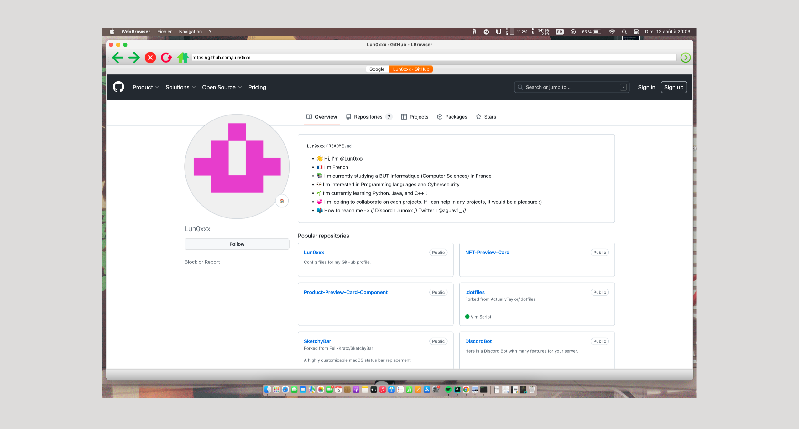
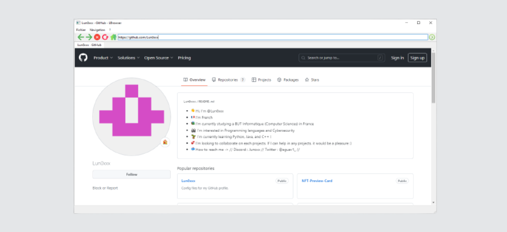

# LBrowser
Here is a web browser made in C++ for fun

-------------------------------------------------------------------------------------------------------------------------------------------------------------------

🇫🇷 Français

Voici un navigateur Web développé en C++ grâce à la librairie Qt.

**Conseils d'utilisation**

Ceci a été développé avec la librairie Qt 6.5.2. Il vous faudra donc la télécharger et l'installer.
Une fois fait, vous créez un projet Qt C++ et vous glissez les fichiers dedans.

-------------------------------------------------------------------------------------------------------------------------------------------------------------------

🇬🇧 English

Here's a web browser developed in C++ using the Qt library.

**Usage Tips**

This was developed using the Qt 6.5.2 library, so you'll need to download and install it.
Once that's done, create a Qt C++ project and drag the files into it.

-------------------------------------------------------------------------------------------------------------------------------------------------------------------

**Preview for macOS**

**Preview for Windows**

